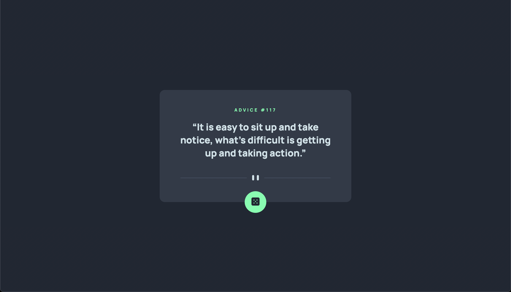

# Frontend Mentor - Advice generator app solution

This is a solution to the [Advice generator app challenge on Frontend Mentor](https://www.frontendmentor.io/challenges/advice-generator-app-QdUG-13db). Frontend Mentor challenges help you improve your coding skills by building realistic projects.

## Table of contents

- [Overview](#overview)
  - [The challenge](#the-challenge)
  - [Screenshot](#screenshot)
  - [Links](#links)
- [My process](#my-process)
  - [Built with](#built-with)
  - [What I learned](#what-i-learned)
  - [Continued development](#continued-development)
  - [Useful resources](#useful-resources)
- [Author](#author)
## Overview

### The challenge

Users should be able to:

- View the optimal layout for the app depending on their device's screen size
- See hover states for all interactive elements on the page
- Generate a new piece of advice by clicking the dice icon

### Screenshot

### Links

- Solution URL: [github](https://github.com/thihnezzy/advice-generator)
- Live Site URL: [Advice Generator](https://your-live-site-url.com)

## My process

### Built with

- Pure HTML/CSS
- JS (Async/Await)

### What I learned

- Improve my CSS skill, better understand about *em* and *rem* units. 
- Speed up my markup and styling skills.
- Using netlify to host the website.
- Fetching API

To see how you can add code snippets, see below:

### Continued development

- Desktop first
- I'm looking forward to build responsive website for mobile design.

### Useful resources

- [Drop shadow effect](https://developer.mozilla.org/en-US/docs/Web/CSS/filter-function/drop-shadow) - This helped me for creating effect for active state for the button

## Author

- Github - [github](https://github.com/thihnezzy)
- Frontend Mentor - [@yourusername](https://www.frontendmentor.io/profile/nobody1234455)